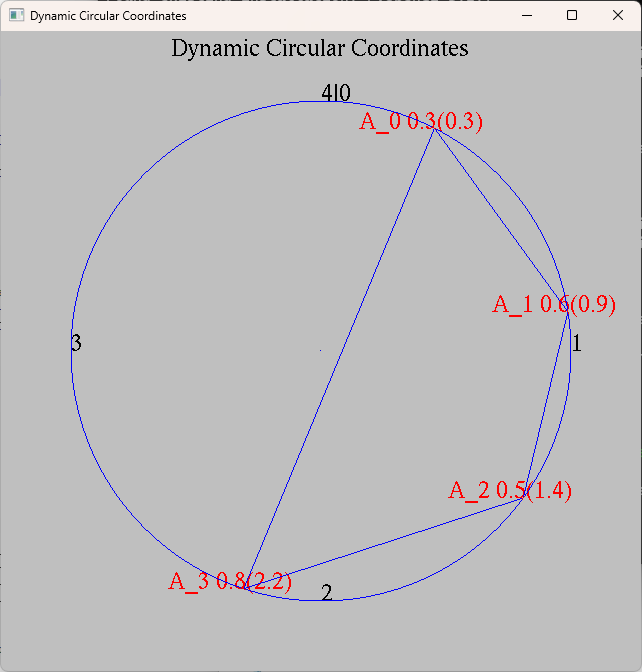

# Dynamic Circular Coordinates

OpenGL data visualization of 4-D points encoded in dynamic circular coordinates.  
Coordinate system consisting of a circle with a circumrference of 4 units.  

Example 4-D point a = (0.3, 0.6, 0.5, 0.8)  

Demo of above point:    

# Packages

Required packages: numPy, PyOpenGL and PyOpenGL_accelerate, PyGLM, freetype-py  
Optional packages: wheel for build improvements  

__Windows note__: PyOpengl pip package should be from [here](https://www.lfd.uci.edu/~gohlke/pythonlibs/#pyopengl) as the pip package does not include binaries by default

## references

-[Python OpenGL introduction](https://noobtuts.com/python/opengl-introduction)  
-[glutGet state integer constants](https://www.opengl.org/resources/libraries/glut/spec3/node70.html)  
-[openGL wikibook](https://en.wikibooks.org/wiki/OpenGL_Programming)  
-[openGL primitive](https://www.khronos.org/opengl/wiki/Primitive)  
-[Text-Rendering](https://learnopengl.com/In-Practice/Text-Rendering)  
-[Text-Rendering Demo](https://github.com/Rabbid76/graphics-snippets/blob/master/example/python/text_freetype/freetype_text.md)  
-[Google Python Style Guide](https://google.github.io/styleguide/pyguide.html)  

